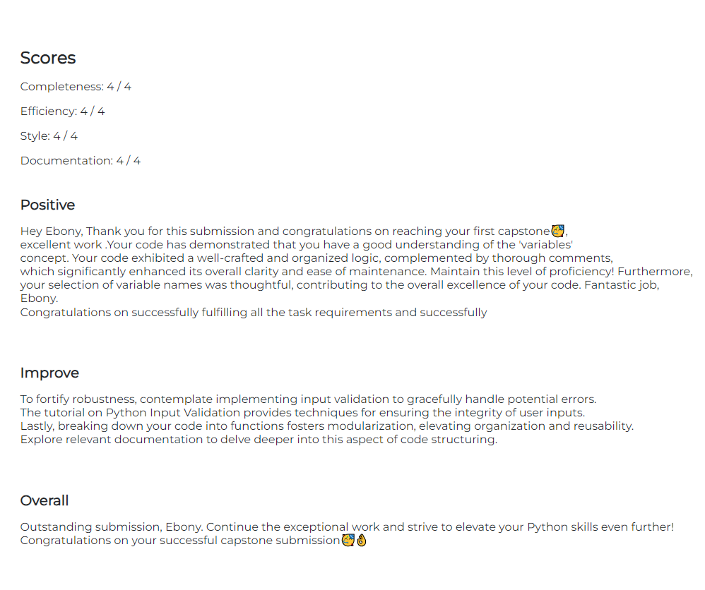

# Skills Bootcamp Capstone Project
 My first capstone project within my Skills Bootcamp for Software Engineering

The brief for this task is as follows:
"For this Capstone Project, assume that you have been approached by a small financial company and asked to create
a program that allows the user to access two different financial calculators: an investment calculator and a home loan
repayment calculator"

My feedback includes maximum scores for Completeness, Efficiency, Style and Documentation. See below:
